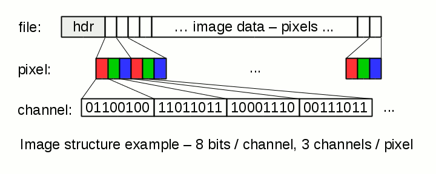

The task is to develop a function to handle an image file -- the function shall be able to read the image, flip it, and save the modified image.

We assume a simple uncompressed image files in this assignment. An image can be seen as a 2D array of pixels, the size of the image corresponds to the width and height of the array. The easiest way to save a 2D array into a file is to traverse the array in a row-major order, i.e., save the first row, then second row, ..., until the entire array is serialized into the target file. Pixels in the image do not need to be integers, instead, each pixel of the image may be formed from tuples (channels), e.g. 3 channels (RGB components), 4 channels (RGB and opacity component), or simple 1 channel (shades of gray). Next, each channel value is represented with some precision, the precision is given by the number of bits per channel value. We assume precision 1 bit, 8 bits, or 16 bits per channel, and we assume 1, 3, or 4 channels per pixel.

Image flipping is very simple image processing operation. The required function will be able to perform the flipping, based on the parameters. The flipping may be horizontal (by vertical axis), vertical (by horizontal axis), both vertical and horizontal, and none (i.e., plain copy). The required function interface is:

bool flipImage ( const char * srcFileName, 
                 const char * dstFileName, 
                 bool         flipHorizontal,
                 bool         flipVertical );

srcFileName
    is an ASCIIZ string denoting the name of the source image file. The function is supposed to read the source image, however, it cannot modify it.

dstFileName
    is an ASCIIZ string denoting the name of the resulting image file. The function creates/overwrites the resulting file and stores the updated image into the file.

flipHorizontal
    true if the function shall do the horizontal flip (by vertical axis),

flipVertical
    true if the function shall do the vertical flip (by horizontal axis),

return value
    true to indicate success, false to report a failure. The following shall be considered a failure:

        -file or I/O related problems (cannot read/write, file does not exist, ...),
        -invalid input file format (invalid header, invalid pixel format, not enough image data, too many bytes in the file, ...).

The function creates the resulting file based on the source image and parameters:

    -resulting image size is determined by the source image size,
    -resulting image pixel format and endianity is identical to the source image pixel format and endianity,
    -image data in the image file are modified based on the flipHorizontal/flipVertical parameters.

The image file format is very simple. The file starts with a fixed size header that is followed by the image data. The header has the following structure:

offset   size         description
+0       2B           endianity (0x4949 little endian, 0x4d4d big endian)
+2       2B           image width
+4       2B           image height
+6       2B           pixel format
+8       ??           image data (pixels)

    -Little/big endian identifier is the first field in the header. The field describes the byte order of two byte values stored in the file. The actual values (0x4949 and 0x4d4d) are symmetric, thus the field can be correctly read by any platform. This field will be set to little endian in the mandatory tests (little endian is the platform your program runs on). However, the value may be either little endian or big endian in the optional tests. (Actually, there are few invalid inputs in the mandatory tests where the endianity is set to a random value. Obviously, such inputs must be rejected).
    -Width and height fields denote the dimensions of the image. The values must be non-zero.
    -Pixel format describes the coding of individual pixels. The value is composed from individual bits:

        bit  15            5  4 3 2  1 0
             0 0    ...    0  B B B  C C
       

    Each pixel may consist of several channels. Bits 1 and 0 denote the number of channels per pixel:

        00 - 1 channel: black/white, or shades of gray
        01 - invalid combination
        10 - 3 channels = RGB
        11 - 4 channels = RGBA
       

    Each channel value is coded in the given number of bits:

        000 -  1 bit per channel
        001 -  invalid combination
        010 -  invalid combination
        011 -  8 bits per channel
        100 - 16 bits per channel
        101 \
        110  | invalid combination
        111 /
       

    Bits 5-15 are not used, they must be set to zero. A few examples:

       0x000c = 0b00001100 - 1 channel per pixel, 8 bits per channel
       0x000e = 0b00001110 - 3 channels per pixel, 8 bits per channel
       0x0013 = 0b00010011 - 4 channels per pixel, 16 bits per channel